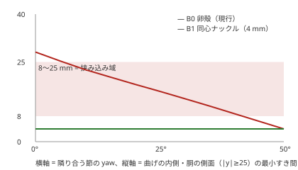
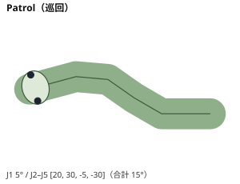
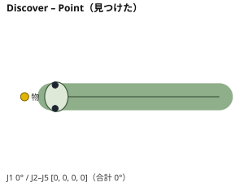
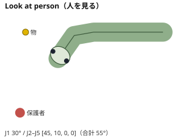
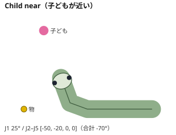
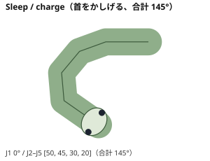
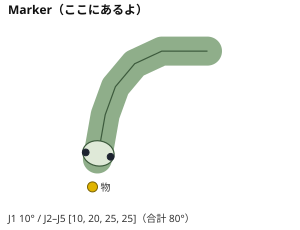

# Serpens 外観・振る舞いコンセプト探索（Design Run DESIGN-2026-09-29-01）

作成 2026-09-29、Design Agent。**Design の提案であって正式 Decision ではない。**
数値は `docs/design/tools/concept_geometry.py` の概算（DESIGN_ESTIMATE）。**HUMAN_EVALUATED = 0 / HARDWARE_UNVERIFIED。**
スコアは Design Agent の見立てで、人の評価ではない。Engineering 仕様（センサー位置・可動域・安全の数値）は変えていない。

## 0. 出発点（現行 FW03 を読んで分かったこと）

Fusion `Serpens_FW03_CLEARANCE_STUDY_NOT_FOR_PRINT` v6 を**読み取り専用**で開き、外装とセンサー参照箱の bbox を読んだ（変更・保存なし）。

| 観察 | 数値（FW03） | 何が問題か |
|---|---|---|
| 頭が首・胴より細い | 頭 76 / 首 88 / 胴 92 mm 幅 | 蛇は「首より頭が広い」のが最大の手がかり。赤ちゃん図式（大きい頭）にも反する |
| 目が小さく正面だけ | D14、頭高 74 の 0.19 倍、法線は前寄り | 横・上（保護者の視点）からほぼ見えない（§2 の見かけ面積） |
| 卵が 15 mm 空けて連なる | 卵 a40 × 半幅 46、関節の隙間 15 mm | 芋虫・数珠に見える。**隙間が 8〜25 mm の挟み込み域**（構想設計書 16 章）で、曲げの内側で閉じていく |
| 前面が球面 | 顔の前面 X−232 に Z5〜70 のセンサーが縦に並ぶ | 床すれすれの斜め照明（Z5〜9）が球の外に出る。窓で逃がしている |
| 首の卵が短く J2 サーボが露出 | 首殻 a25 | 首と頭の境目が読めない |

**結論**: いまの外観は「EX-1 の卵型を載せた機構スタディ」で、蛇らしさ・かわいさ・安全の見え方の 3 つとも改善の余地が大きい。
しかも 3 つは同じ場所（頭と首の比率、関節の隙間）で起きているので、**別々に直さず 1 つの形で同時に解く**。

## 1. 頭部の比較

| 案 | 形 | 狙い |
|---|---|---|
| **H0 Egg** | 現行の卵（76 × 74） | 基準 |
| **H1 Bean** | 平らなあご＋丸い鼻先＋盛り上がった頭頂。幅 100（胴より広い）、首を絞る | 蛇の「頭 > 首」と赤ちゃん図式を両立。前面を平らにしてセンサーを顔の造作に割り当てる |
| **H2 Wedge** | 写実寄り。長く平たい鼻先、幅 80 | 蛇らしさ最大化の比較用 |
| **H3 Cyclops** | カメラそのものを 1 つ目にする | 「どこを見ているか」が正直になる |
| **H4 Visor** | 顔全体を濃色の窓で覆い、中に LED の目 | 製造・清掃が簡単、LED で表情 |

### 1.1 数値（DESIGN_ESTIMATE。質量は PETG 2 mm 殻 ＋ 電子部品 30 g の仮定）

| | H0 Egg | **H1 Bean** | H2 Wedge |
|---|---|---|---|
| 幅 × 高さ（mm） | 76 × 74 | **100 × 74** | 80 × 59 |
| 頭幅 / 胴幅 | 0.83 | **1.09** | 0.87 |
| 目の径 / 頭高 | 0.19 | **0.32** | 0.27 |
| 頭の質量（ASSUMED） | 62 g | **92 g** | 90 g |
| 重心の J1 からの前方距離 | 28 mm | **22 mm** | 32 mm |
| J1 の静的トルク最大（0〜45°） | 0.017 N·m | **0.020 N·m** | 0.028 N·m |
| ソフト上限 0.45 N·m（REFERENCE 由来）に対する割合 | 3.7 % | **4.3 %** | 6.3 % |
| カメラ視錐台に殻がかかるか | なし | **なし** | なし |
| 目の見かけ面積: 子ども正面 1 m | 254 mm² | **624** | 123 |
| 同: 保護者 横・立ち 2 m | 111 | **343** | 176 |
| 同: 真上 | 159 | **272** | 80 |

- H1 は頭が 30 g 重くなるが、J1 の静的トルクへの影響は **+0.003 N·m**（重心がむしろ J1 に近づく）。Engineering の仮定 `head_total: 90 g` とほぼ同じ。
  頭スキッドへの床反力・摩擦が増える影響は未評価（OQ-0105 と同じ場所）。
- 目は **3 方向とも H0 の 2〜3 倍**見える。Floor Watch の「保護者が離れた所から見て分かる」に直接効く。
- H2 はカメラ上 35 mm の縦基線ライン光（Z62〜70）が低い鼻先に入らない。鼻先を延ばすとカメラも前へ出て重心が J1 から離れる。

### 1.2 評価（1〜5。Fear は **低いほど良い**。Design Agent の見立て、人の評価ではない）

| 観点 | H0 | **H1** | H2 | H3 | H4 |
|---|---|---|---|---|---|
| Snake-likeness | 2 | **4** | 5 | 1 | 2 |
| Cuteness | 3 | **5** | 2 | 3 | 3 |
| Approachability | 3 | **4** | 2 | 3 | 3 |
| Child friendliness | 3 | **4** | 2 | 3 | 3 |
| Animacy | 2 | **4** | 4 | 3 | 3 |
| Affection | 3 | **4** | 2 | 2 | 3 |
| Fear（↓） | 1 | **2** | 3 | 2 | 2 |
| Mechanical plausibility | 4 | **3** | 2 | 4 | 3 |
| Sensor integration | 2 | **4** | 2 | 5 | 3 |
| Manufacturability | 4 | **3** | 3 | 4 | 3 |
| 3D printability | 4 | **3** | 3 | 4 | 2 |
| Maintenance | 3 | **3** | 3 | 4 | 4 |
| Safety perception | 3 | **4** | 2 | 2 | 3 |
| Floor Watch readability | 2 | **4** | 3 | 4 | 4 |
| Charging pose quality | 3 | **3** | 3 | 3 | 3 |
| Home interior compatibility | 4 | **4** | 3 | 3 | 4 |

- **H3 を採らない理由**: 見えるカメラ＝目は「見張られている」印象を保護者に与えやすい（プライバシーの感じ方）。
  視線が常に 25° 下向きになり、しょんぼりして見える。蛇らしさが消える。視線が正直になる利点は H1 の「頭ごと向く」で得る。
- **H4 を採らない理由**: カメラ・ToF・ライン光と LED の目が同じ窓の裏に入ると、窓の内面反射で光が混ざる（ToF のクロストーク、撮影のフレア）。
  光学の問題を外観で作る。目が画面になるとロボット顔になり蛇らしさが落ちる。
- **H2 を採らない理由**: かわいさと Engineering（ライン光の基線、J1 の腕の長さ）の両方で負ける。蛇らしさは H1 でも「頭 > 首」で十分出る。
- **Fear について**: 幅広の頭は、角ばると毒蛇（三角形の頭）を連想させる恐れがある。**H1 は角を作らず、あごの角も丸める**。
  縦長の瞳孔も同じ理由で使わない（丸い瞳）。これは Design の仮説で、人の評価で確かめる（§7）。

### 1.3 H1 Bean の中身 — センサーを「顔の造作」にする

Engineering の参照位置（X−232 の前面に Z5〜70）を動かさずに、**顔のどの部分に見えるか**を割り当てる。

| センサー（Engineering 位置） | 顔の造作 | 理由 |
|---|---|---|
| カメラ（Z30、中央） | **ボタン鼻**。濃色の丸い平窓 | ぬいぐるみの鼻の位置。レンズが「目」に見えないので視線が混ざらない。鼻先が短いほど視野が空く（かわいさと FOV が同じ向き） |
| 前 ToF（Z42〜55） | **鼻孔**。発光・受光の 2 つの小窓 | 蛇の鼻孔は鼻先の上にある。VL53L1X の 2 開口と数が合う（窓の条件は Engineering 確認） |
| 斜め照明（Z5〜9、左右） | **下唇の影**。あごの張り出しの下に隠す | 光源が直接見えず、口が光って歯のように見えるのを避ける。まぶしさも減る |
| IR LED（カメラ横） | 鼻の横（見えない） | — |
| ライン光（LED＋スリット） | **眉の段**。鼻先の上の段差（X≈−233〜−229, Z64〜70）から斜め下へ | 蛇の眼上板（眉）に当たる位置。鼻先の高さを 60 以下に抑えられる（前 ToF Z42〜55 の窓が顔に載る最小の高さ）。**眉は顔の面から 6 mm 以内（X ≥ −230）に置く**: −226 まで下げると、レンズ前 38〜48 mm の床へ向かう急な光線を鼻先が遮る（`concept_geometry.py` の line_light_occlusion）。縦基線は FW03 とほぼ同じ約 36 mm。**Engineering 確認が要る**（基線と角度が変わる） |
| WS2812B ×2（頭頂） | **目の虹彩リング**へ移す提案 ＋ 胴 LINK1 の状態 LED は残す | 状態が目に出るとペットの表情として読める。真上からの見え方は胴の LED で補う |
| 下 ToF・スキッド | あご下（見えない） | — |

- 頭幅 100 mm なので、**PRODUCT.md にある横基線 30 mm・45° 内向きのライン光も入る**（頬＝蛇のピット器官の位置）。縦基線と横基線のどちらがよいかは Engineering の判断（OPEN-SERPENS-DESIGN-001）。
- 視錐台の規則（どの案でも守る）: レンズより前に出る殻は、前方距離 d に対し **Z < 30 − d·tan46° か Z > 30 − d·tan4°**。
  眉の段や頭頂の丸みは、レンズより上にある限り視野を遮らない（J1 を上げても頭の座標では同じ）。
- 目: 径 24 の半球ドーム、中心 (−212, ±37, 60)、法線は前 38°・外 46°・上 17° 程度。**丸い大きな瞳**＋ハイライト。
  蛇にはまぶたが無いので「まばたき」はせず、**光の強弱（目の光が落ちる）**で眠さ・集中を表す。
- 首: 頭の直後で幅 **64 mm 程度まで絞る**提案。首の中の J2 サーボ（±12.4）・首シャーシ（±24）が入るかは Engineering 確認。
  6 本目を頭 yaw にする案（ENTRY-0001 の B）なら、頭 yaw サーボを**鼻先ではなく首に置く**と、延長 50 mm が「首」に見えて蛇らしくなる。
- J1 まわりの頭の後端は、**J1 軸と同心の円弧**にする（首の上を頭がすべるだけで、すき間が変わらない。§3 と同じ考え方）。

## 2. 胴・関節の比較

| 案 | 内容 |
|---|---|
| **B0 Egg chain** | 現行。卵殻を 15 mm 空けて並べる |
| **B1 同心ナックル** | 関節軸と同心の面だけで節どうしが向き合う。前の節の後端 = 軸まわりの円柱（半径 46）、後ろの節の前端 = 半径 50 の受け（唇は ±40°）。上下は後ろの節の「フォーク」（ヨーク）を丸い背板・腹板で覆う。木製の蛇のおもちゃと同じ構造 |
| **B2 重ね鱗** | 背の鱗板を重ねてすべらせる |
| **B3 TPU ベローズ** | 節の間を TPU の蛇腹でつなぐ |
| **B4 ニット／ぬいぐるみの袋** | 全身を洗える布で覆う |

### 2.1 挟み込みの数値（上面視の 2D 近似。曲げの内側・胴の側面 |y| ≥ 25 の最小すき間）

| yaw | 0° | 10° | 20° | 30° | 40° | 50° |
|---|---|---|---|---|---|---|
| B0 卵殻（mm） | 28.1 | **22.6** | **18.0** | **13.5** | **8.8** | 4.0 |
| B1 同心ナックル（mm） | 4.0 | 4.0 | 4.0 | 4.0 | 4.0 | 4.0 |

- **B0 は 10〜40° で 8〜25 mm の帯を通って閉じていく** = 横から入った子どもの指を挟む形。中心線のすき間（15 mm）も帯の中。
- **B1 はどの角度でもすき間 4 mm で一定**（指が入らない）。唇の先の V 溝は常に約 97°（鈍角）で、入った指は押し出される向き。
  条件: **唇の角度 ≤ 90° − yaw 最大（= 40°）**。これを超えると曲げの内側で唇が前の節へ入る。
- これは形だけの 2D 計算。**上下の板のすき間・公差・ケーブル・実際の指の模型での確認は未実施。** 安全と判定しない（Engineering と Human の判断）。

### 2.2 評価

| 観点 | B0 | **B1** | B2 | B3 | B4 |
|---|---|---|---|---|---|
| Snake-likeness | 2 | **4** | 5 | 4 | 3 |
| Cuteness | 4 | **4** | 3 | 4 | 5 |
| Approachability | 3 | **4** | 3 | 4 | 5 |
| Child friendliness | 3 | **4** | 3 | 4 | 5 |
| Animacy | 3 | **4** | 4 | 4 | 3 |
| Affection | 3 | **4** | 3 | 4 | 5 |
| Fear（↓） | 1 | **1** | 2 | 1 | 1 |
| Mechanical plausibility | 4 | **3** | 2 | 2 | 2 |
| Manufacturability | 4 | **3** | 2 | 2 | 3 |
| 3D printability | 4 | **3** | 2 | 2 | — |
| Maintenance（サーボ交換） | 4 | **3** | 2 | 3 | 3 |
| Safety perception | 2 | **4** | 3 | 5 | 4 |
| Floor Watch readability | 3 | **3** | 3 | 3 | 2 |
| Charging pose quality | 3 | **4** | 3 | 4 | 3 |
| Home interior compatibility | 3 | **4** | 3 | 4 | 5 |

- **B2**: 鱗がすべる縁がせん断の刃になる。部品点数が多い。
- **B3**: 蛇腹の曲げ剛性がトルクを食い、±50° の繰り返しで TPU が割れやすい。熱がこもる（サーボ 60℃ 停止の手前で効く）。
- **B4**: かわいさ・触り心地は最高で、将来の「撫でる・持ち上げる」段階の本命候補。ただし布がホーン・ヨークに噛む危険が
  内側に隠れる（見えない挟み込み）。熱・床との摩擦・LED とカメラ窓の処理・衛生が未解決。**MVP では採らず、後の段階の研究候補にする。**

### 2.3 B1 の外観

- 上から見ると、関節ごとに**丸い背板**（直径約 96）が並ぶ。これを「背の大きな鱗（椎骨の板）」として見せる。卵が離れて並ぶ数珠ではなく、**すき間 4 mm で連続した 1 本の体**に見える。
- 背板は後ろの節のヨークに付く。前の節の上面は背板の下に 3 mm 程度下がる（上下のすき間も一定）。
- サーボ交換は背板をねじで外す（工具が要る = 子どもが開けられない）。
- **R04 の上ループ配線とは両立しない**（背板の上に出る）。R05 横通し・関節の渡り（FW04 で未設計）が前提。配線が関節を渡る位置が最大の依存（ENTRY-0006）。

## 3. 表面・色・腹・尾

- **色の分け方**: 背 sage、腹 ivory（現行を維持）。腹の ivory を**側面の 40 % の高さまで回す**と、高さ 94 の胴が低く長く見える（縦横比 6.1 の短い体を、色で細長く見せる）。
- **背の中心線にクリーム色の帯**（ガーターヘビの背線）。尾から鼻先まで 1 本通すと、**上から見て体の向きが矢印として読める**。発見の構え（一直線）では、その帯が物を指す。
- **使わないもの**（恐怖・警告色を連想させるため）: 赤・黄・黒の縞（サンゴヘビの警告色）、菱形・ジグザグ（毒蛇）、縦長の瞳孔、三角の頭、開いた口・牙、S 字の鎌首（既に演出から外されている `s_curve`）。
- **質感**: つや消し。濡れたように光る面は「ぬめり」を連想させる。鱗の浮き彫りは背板だけに浅く（印刷で出る 0.4 mm 以上）、他は拭きやすい平滑面。
- **腹**: 交換式の摩擦インサート（CAD の S30）を**腹板（ventral scute）の形**にする提案。横方向の段が並ぶ形は、本物の蛇の腹板が作る摩擦の異方性
  （Hu et al., PNAS 2009 "The mechanics of slithering locomotion" の論旨。一次資料で要確認）と同じ向き。
  **形は Design、摩擦比は H0 クーポンで実測（OQ-0102）。** 摩擦の結論を Design が出すわけではない。
- **ローラーを使う場合（ENTRY-0002 への回答）**: 腹板の中に凹ませ、突出は 2〜3 mm。側面の ivory の帯を床上 3 mm まで下ろした「スカート」で、
  子どもの目線（約 11°）と保護者の立った目線（約 37°）のどちらからも見えないようにできる。
  **ただし軸・ローラーは髪の毛・指の巻き込み点**になるので、覆いのすき間は Engineering の安全側の判断に従う。尾の節だけの Hybrid なら尾殻の下に隠しやすい。
- **尾**: 停止ボタン（尾の上、X290〜302）は保護者がすぐ分かる必要がある。赤い停止ボタンを**尾の先の輪の中に少し沈めて**置く案と、尾の色に溶かす案がある。
  子どもが押しても止まるだけ（安全側）なので、Design は「見つけやすい赤」を推す。User 判断（OPEN-SERPENS-DESIGN-007）。
  尾の先に柔らかい TPU の先細り（+40〜60 mm）を足すと蛇らしくなるが、全長・旋回・ドックに効く（OPEN-SERPENS-DESIGN-008）。

## 4. 振る舞い — 守る行為をペットの行動にする

### 4.1 最重要の発見: 「見せる」ことが子どもを危険物へ連れていく

幼児は 1 歳前後から**相手の視線や指さしの先を見る**（視線追従。発達心理学でよく知られる現象。文献は要確認、例: Brooks & Meltzoff 2005）。
誤飲が起きやすい年齢と重なる。したがって、

- Serpens が物を見つめる・頭で指す・物の横で光る・とぐろを巻く = **子どもの注意をその床の一点へ運ぶ**。
- 物の横で待つ「生きたピン」も、Serpens 自体が子どもを呼び寄せるので、**結果として物のそばへ連れてくる**。

これは Design の最初の案（物 → 人 → 物、危険物付近でとぐろ）の中に入っていた危険で、**見せ方の工夫では消えない**。
そこで振る舞いを次の規則で組み直す（**Design の提案。安全に関わるので Engineering 確認と Human Approval が要る**）。

### 4.2 Child-Safe Attention Rules（CSAR）

> **2026-09-29 User 採用（USER-DEC-SERPENS-DESIGN-0001 #1）。** MVP: 見せびらかさない → 再確認と位置登録の後、基本は危険物から少し離れる → 子どもが近ければ子ども側を見る。危険物のそばのとぐろは MVP で不採用（遮蔽効果と誘導リスクは将来の実験で再評価）。

| # | 規則 | 実装のつなぎ先（Engineering 判断） |
|---|---|---|
| R1 | **子どもが近いかもしれない間は、危険物を見ない・指さない・体の線を向けない。** 近い = `risk.child_near_m`（2.0 m）以内、または**不明**（安全側） | highlight_point の実行条件、`floor_watch` の姿勢選択 |
| R2 | **危険物の場所を目立たせない。** 子どもが近い間は、物の近くで光・音・遊ぶ動きを出さない。撮影の閃光も物を照らすので、子どもが近い間は撮影を後回しにする案 | `agent/STATE.md` の未決「人が近いときの inspect の可否」と同じ論点 |
| R3 | **見つけたら物から離れる。** 物の横に残らない・囲まない・とぐろを巻かない | Task 完了後の移動 |
| R4 | **知らせる相手は保護者。** まず通知（アプリ / Webhook）。体での合図は、子どもが近くにいない時だけ | Home AI の attention manager |
| R5 | **子どもが来たら、Serpens が注意を引き受ける。** 頭と目を子どもへ向け、物とは反対側へ外す。やわらかい目の光で「こっちを見て」 | 姿勢と LED。子どもへ近づく動きは入れない（将来機能、別の安全検証） |

**一言で**: 「見つけたら、見せびらかさず、離れて、大人に知らせる。子どもが来たら、こっちを見てもらう。」
これが「守る行為そのものがペットの自然な行動に見える」形だと考える。ペットが何かを咥えずに飼い主のところへ知らせに来る、に近い。

### 4.3 Discovery Loop（子どもが近くにいない時）

| 段 | 見た目 | 関節（提案。範囲は J1 0〜40°、J2 ±50°） | 光・音 | ねらい |
|---|---|---|---|---|
| 1 気づく | 巡回中に止まる、鼻先が少し下がる | J1 5 → 0° | 目がふっと明るく | 「あれ？」 |
| 2 じっと見る（撮影） | **体ごと一直線に静止**（ポインター犬の構え）。背の帯が物を指す | 全 yaw 0°、J1 0° | **撮影中は表現用の LED を全部消す**（目も）。「息を止めて見つめる」に見える | 撮影の静止要件と同じ動き |
| 3 周りを見る | 頭を上げて左右を見る | J1 25〜30°、J2 ±30° | 目は通常 | 人を探す |
| 4 人を見る | 保護者の方へ頭ごと向く | J2 → 人の方向、J1 30° | 目を明るく、短い明るい音（警報音にしない） | 「ねえ」 |
| 5 もう一度物を見る | 頭を物の方へ戻して下げる | J2 → 0°、J1 → 5° | — | 「ここだよ」 |
| 6 離れる | 物から離れて、保護者の側・開けた床へ | 歩容 | 呼吸 | R3 |

**途中で子どもが近いと分かったら（R1・R5）**: 3〜5 をやめる。頭と目を子どもへ向け、物から約 70° 外す（下の図）。
光は控えめ（`PETTED` のような暗めの暖色）、音は出さない。通知は保護者へ（P0）。物からはゆっくり離れる（人の近くは 0.05〜0.08 m/s）。

### 4.4 姿勢（上面視。`concept_geometry.py` の順運動学、尾の線分を固定）

| Patrol | Discover – Point | Look at person |
|---|---|---|
|  |  |  |
| **Child near（R1・R5）** | Sleep / charge | ~~Marker（生きたピン）~~ 不採用 |
|  |  |  |

- どの姿勢も yaw ±50° と J1 0〜45° の範囲内。**眠り（三日月）は yaw 合計 180°**。輪（とぐろ）ではないが、機体側に合計角の上限（Q8、例 180°）が入ると境目になる。
- 頭 yaw が無い 5 サーボでは、「人を見る」「子どもから物を外す」は J2 で**頭と首ごと**向く。6 本目を頭 yaw にすれば、体を止めたまま視線だけ動かせ、R1 の「すぐ目をそらす」が速くなる（ENTRY-0001 への回答）。

### 4.5 LED・音の語彙（既存の `behavior.expression.eyes` に合わせる提案）

- 巡回: やわらかい青緑（既存 PATROL）。発見: 目がふっと明るく（明るさだけ上げる）。撮影中: **全消灯**（全消灯の 1 枚と斜め照明の影を汚さないため。Engineering 確認）。
- 保護者を呼ぶ: 暖かい黄色の短い点滅 2 回。子どもが近い: 暗めの暖色でゆっくり呼吸。眠り: 既存 SLEEP。
- 音: 保護者を呼ぶ音は「短く、明るく、上がる 2 音」。警報のような連続音はしない（子どもが寄ってくる・怖がる）。**子どもを寄せずに大人に届く音があるかは未知**（OPEN-SERPENS-DESIGN-006）。

## 5. 採用する方向（Design 推奨、Engineering 検証待ち）

> **2026-09-29 User: 継続検討を承認（USER-DEC #3）。CAD_CONCEPT / KINEMATIC_SIM。4 mm 一定の gap は安全確定ではない（Engineering 検証待ち）。6 本目は暫定 Head Yaw（#2、H0 摩擦試験で最終決定）。ENTRY-0011 は Engineering 回答待ち（#8）。**

**SD-01「Bean head ＋ 同心ナックル」**

1. 頭 H1 Bean（幅 100 > 胴 92、目 24 mm、平らなあご、ボタン鼻のカメラ、鼻孔の ToF、下唇の影の斜め照明、眉の段のライン光）
2. 首を絞る（幅 64 目安）。頭 yaw を足すなら首に置く
3. 胴 B1 同心ナックル（すき間 4 mm 一定、背板＝大きな鱗）
4. 腹は腹板形の交換インサート、色は sage / ivory ＋ 背線、つや消し
5. 振る舞いは CSAR（R1〜R5）と Discovery Loop

**不採用**: H2 Wedge / H3 Cyclops / H4 Visor、B2 重ね鱗 / B3 ベローズ（B4 ニットは将来の研究候補）、
「危険物の横でとぐろ」「物の横で待つ生きたピン」（どちらも子どもを物へ呼び寄せる）。

## 6. Engineering への影響（詳細は `ai-shared/integration-log.md`）

頭の質量 +30 g（J1 静的 +0.003 N·m）/ 首幅 64 の収まり / ライン光の位置と基線 / WS2812B を目へ移す配線 / 目のドームの光が撮影に入らないか /
ナックルの半径と内部部品・ケーブルの渡り / R04 上ループの廃止 / 撮影と子どもの距離（R2）/ highlight_point の実行条件（R1）。

## 7. 人の評価で確かめること（Design の仮説）

既存の Human Perception Pilot（`docs/human_pilot.md`）の尺度（snake_likeness / animacy / approachability / affection / fear、最初に snake_comfort）をそのまま使い、
H0 / H1 / H2 の静止画（同じ角度・同じ色）で比べる。仮説: H1 は H0 より affection と approachability が上がり、fear は上がらない。H2 は snake_likeness が最も高いが fear も上がる。
保護者向けには「Child near の振る舞いを見て安心するか」を別の質問にする。**小さな差を結論にしない**（n = 8〜12 の予備調査）。

## 8. Fusion の概念モデル（2026-09-29 に一から作成）

- ドキュメント: **`Serpens_DESIGN_SD01_BEAN_KNUCKLE_CONCEPT_NOT_FOR_PRINT`**（Default Project / Serpens）。既存の FW03 などは開いて読んだだけで変更していない
- 中身: HEAD（H1 Bean、目・ボタン鼻・鼻孔・眉のスリット）/ NECK（幅 68）/ LINK1〜3 / TAIL（同心ナックルの外形、背板、腹板、停止ボタン）/
  REF（FW03 v6 の参照箱 41 個、非表示）/ SCENE（硬貨）。外装は**詰まった外形**で、肉厚・分割・固定は未設計。部品ではない
- 関節: as-built 回転ジョイント J1〜J5（yaw ±50°。J1 は**このファイルでは負が頭上げ**）。LINK2 が固定
- 描き出し: `renders/SD01_*.png`（巡回・発見・人を見る・子どもが近い・眠り × iso / top、直線の正面・背面・底面、Engineering 参照箱つきの頭）
- 分かったこと:
  1. B1 は各関節の後ろ 0〜46 mm の中段が前の節の円柱になり、FW03 の電池・尾 MCU・ヒューズ・スピーカー／アンプが継ぎ目をまたぐ（ENTRY-0011）
  2. 背板を胴より 2 mm 厚く出すと、横から見て屋根の板が載ったように見える → 胴の面と同じ高さにする（作り直しの途中で Fusion が応答しなくなった。下記）
  3. 首の下は床から浮くので、首に腹板を付けると「脚」に見える → 首の腹板は外した
- **未完了**: 背板を胴と同じ高さに作り直すスクリプトの実行中に Fusion の API が応答しなくなった。最後の保存はジョイント追加の直後。
  それ以降（J1 の名前・範囲の変更、SCENE、首の腹板の削除、背板の作り直し）は保存されていない可能性がある。`renders/` の画像は作り直し前（背板が 2 mm 出ている版）
