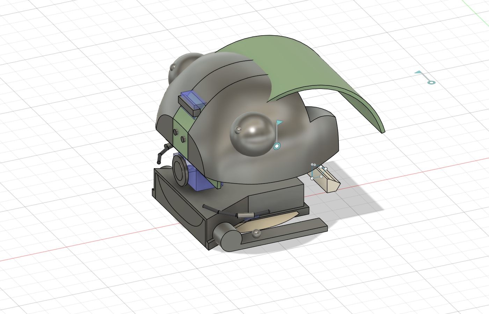

# HEAD INTAKE on E3 — 漏斗つき開放底フードを SD-01E3 ＋ VISOR の頭に統合する検討（2026-09-30）

> **【常に先頭に置く注意】現行の CAD（KNUCKLE DRUM のみ）では、まっすぐ（124 mm³）に比べ、曲げた姿勢で 2250〜2939 mm³ のすき間の体積が残る（約 20 倍、18〜24 倍）。** 背板の層（約 1020 mm³/姿勢）は現行 CAD では未解決のまま（案 (a)(b) は `../plate_layer_2026-09-30.md`）。J1 ピッチは範囲の確認待ち。数値は CAD_CONCEPT / KINEMATIC_SIM（外形 STL・体積のブール演算のみ）。**安全・合格の語は使わない。** 5.7 N・0.25 N·m は暫定（SAFETY_UNVERIFIED）。

Fusion: Recovery 複製の中の `HEAD INTAKE on E3 STUDY - NOT PARTS …`（別コンポーネント。既存の体は変えていない）。数値の由来: **[B]** 依頼 / **[E]** Engineering / **[A]** ASSUMED / **[C]** この CAD から計算。

## 0. 結論（3 行）

1. **フード（口 60 → 奥 30、空間 30×30×15、壁 1.6）は Bean 頭の下前に入る**が、頭の下あご（実体）に **25.0 cm³ の空洞**を掘る必要があり、**Engineering の配置（ToF 下向き・頭のスキッド・ FW03 の斜めの照明）と 3 か所で衝突**する。カメラ窓・ToF（鼻孔）・眉のライン光・口の線は**衝突なし**（屋根から 3.4〜5.4 mm 上）。
2. **頬の下の斜めの照明（E3）は、フードの漏斗の壁に隠れる**（前の床への光線の **88 %** が遮られる）。**フードの口の前の外側の角（x −236、|y| 36、z 6）へ移すと遮られない**（0〜1 %）。
3. **受け身の垂れ布（ゲート）は、空間の入口（x = −206）の屋根の下**に付ける案。開く力は、厚さ 0.3 mm の TPU で 約 0.008 N、**0.4 mm で 0.020 N**（0.2〜0.6 mm で 0.0025〜0.067 N）。**0.01〜0.1 N の想定に合うのは 0.4〜0.6 mm**。指を挟まない形（横のすき間 0.5 mm、角 R3）にした。

## 1. 配置（[A] は仮置き）

- 口の面 = 頭の顔の前面 **x = −236**（鼻の窓は −237）。フードは後ろ（+x）へ 60 mm（漏斗 30 + 空間 30）。床 z = 0（頭のあごの底は z 3）。
- 頭 = `HEAD E2-V VISOR option v2`（E2 の顔 + VISOR の首の頭巾）+ 口の線 + `LIGHT+SKID`（頬の下の LED・双子のスキッド）+ 下の後ろの埋め物。Engineering の位置 = 非表示の `REF Engineering boxes from FW03 v6`。
- フードの形は B2 と同じ（`test_piece_b/B2`）。ここでは頭に埋め込むので、ロッド穴・クランプ座は無し。

（あごの実体を隠して、フードの壁・屋根・センサー箱を見せた図。青 = センサー、暗い箱 = フード）

## 2. 体積の表（mm³、TemporaryBRep のブール演算 [C]）

フード = 材料（壁 + 屋根 + 足の帯）9,199 mm³ ＋ 空洞（漏斗 + 空間、z 0〜15）33,750 mm³。

| 相手 | 空洞の中 mm³（掘る／移す） | 材料の中 mm³（壁が食い込む） | 判定（Design の見立て） |
|---|---|---|---|
| **下あご `E2-V HEAD E2 lower jaw`（実体）** | **25,012** | 6,467 | 空洞を**掘る**（頭の殻を空洞にする設計が要る）。壁は 実体の中に入る |
| **`CHIN SHIELD` 2 枚（顎板のそり）** | 109 + 110 | 107 + 107 | **全部フードの中**。顎板はフードの足の帯（3.6 幅）に置き換える |
| `LIGHT+SKID` の双子スキッド（|y| 30〜40） | 0 | 6.3 ×2 | フードの足の帯の縁と重なる（|y| 35 以上へずらす）|
| **REF ToF 下向き（x −200〜−182、z 5〜7）** | **648（100 %）** | 0 | **空間の中**。移す（下の 3 案） |
| **REF 斜めの LED（FW03 位置、|y| 15〜22）** ×2 | **140 ×2（100 %）** | 0 | Design の E3 では頬の下（|y| 38〜42）へ移してあり、**この衝突は無い**（ただし §3 の遮り） |
| **REF 頭のスキッド（|y| ≤ 18、z 0〜5）** | **5,130（95 %）** | 250 | **空間の床と置き換わる**。フードの床が床になる |
| Design の頬の下の LED（x −215〜−210、|y| 38〜42、z 5〜10） | 0 | 0 | 衝突なし（漏斗の外形は |y| 23.5 まで細る）|
| REF カメラ XIAO（z 22〜38） | 0 | 0 | 屋根の上面（z 16.6）と **5.4 mm** 離れる。レンズ面（x −237）は口の面より前で、フードは視野に入らない |
| 口の線（z 20〜23）、通常の光の細い穴 | 0 | 0 | 屋根の上面と **3.4 mm** |
| REF ToF 前向き（z 42〜55）、眉のライン光（z 62〜70） | 0 | 0 | 離れている |
| REF J1 サーボ（x −190〜−145、z 20〜45） | 0 | 0 | 屋根の上面と **3.4 mm**（x が重なる範囲） |

**空洞 33.75 cm³ のうち 25.0 cm³（74 %）が下あごの実体、5.1 cm³ が REF のスキッド**（頭の殻を空洞にすれば、その分の質量が減る。実体が中実か殻かは未確認）。

## 3. 照明の遮り（点光源、フードの壁・屋根・足の帯だけを遮蔽物とした光線の検査 [C]）

床の前の 99 点（x −300〜−250、|y| ≤ 20）への光線のうち、フードに遮られた数:

| 光源の位置 | 遮られた | 見立て |
|---|---|---|
| Design の頬の下の斜め LED（x −212.5、|y| 40、z 7.5） | **87 / 99（88 %）** | **漏斗の壁に隠れる**（LED が口の面より 24 mm 後ろ） |
| 口の線の通常の光（x −220、|y| 44.5、z 21.5） | 61 / 143（43 %） | 屋根の側面で一部が遮られる |
| **フードの口の前の外側の角（x −236.5、|y| 36、z 6）** | **0 / 99** | **移す先の推奨** |
| （x −234、|y| 38、z 6） | 1 / 99 | 同じ |
| （x −233、|y| 37、z 7） | 10 / 99 | |
| フードの前縁の上（x −236.5、y 0、z 18） | 0 / 99 | 通常の光の移し先の候補 |

→ **斜めの照明（頬の下）は、フードの口の前の外側の角（x −236.5、|y| 36、z 6）へ移す**（Design の照明の位置の変更。ENTRY-0022 の照明の効き 15 倍 / 11 倍は再計算が要る）。

## 4. ToF 下向きの移し先（3 案）

| 案 | 位置 | 見え方 | 課題 |
|---|---|---|---|
| A | フードの後ろの外（x −172〜−154、|y| ≤ 9、z 5〜7）| 頭の下の後ろから床を見る（口から 64 mm 後ろ） | J1 サーボ（z 20 以上）とは離れる。下の後ろの埋め物（z 9.6〜）と離れる。**視野が口の前の床を見ない** |
| B | **屋根の下面から空間を見下ろす**（x −196、z 15、下向き）| 空間の**中の物**（入った／入っていない）を測る | ゲートの合図（物が奥に入った）に**使える**。前方の縁の検出は別のセンサーが要る。Engineering の確認が要る |
| C | 口の前の外側の角（照明と同居）| 口の前の床の縁 | 場所が狭い |

## 5. 受け身の TPU 垂れ布（ゲート）

- **取り付け位置**: 空間の入口 **x = −206（口の面から 30 mm）**、屋根の下面から床の 0.5 mm 上まで垂らす（長さ 14.5）。**クランプ棒**（4×29×1.2）を屋根の下面に M2 で留める（頭の中から。ねじ頭が空間に出る 1.3 mm は低頭で埋める）。**止め段**（2×1.6×14）を空間の壁の前側に付け、**外向きに開かない**（内向きにだけ開く）。
- **厚み 0.2〜0.4 mm の TPU**（依頼どおり）。開く力（片持ち梁 F = 3EIδ/L³、E = 26 MPa [A]、幅 29、長さ 14.5、先端 5 mm 変位 [C]）: **t 0.2 → 0.0025 N、0.3 → 0.008 N、0.4 → 0.020 N、0.5 → 0.039 N、0.6 → 0.067 N**。**0.01〜0.1 N の想定に合うのは t 0.4〜0.6**（依頼の 0.2〜0.4 の上端が合う）。**推奨は 0.4**。CAD の布は 0.3 で作ってあり、0.4 へは寸法だけ直す。0.2 は柔らかすぎる。
- **指を挟まない形**: (1) 横のすき間 **0.5 mm**（壁と布の縁。5 mm 未満）(2) 下のすき間 0.5 mm（床と布の下端）(3) 下の 2 隅を **R3** の丸め (4) 布を開く動きは内向き（入口の 30 mm 幅の奥へ）で、**止め段と布のあいだ**は 0 mm（布は止め段に当たって止まる）(5) 開いた布と奥の壁のあいだのすき間は 30 → 0 mm まで狭まる（**5〜25 mm を通る**）→ **布の開く角を 45° 以下に止めるのが課題**（未設計。口に入る物が 15 mm の高さなので、布は 10 mm 上げれば足りる）。
- **CAD**: `GATE drape TPU 0.3 …`、`GATE mount bar …`、`GATE stop ledges …`（`HEAD INTAKE on E3 STUDY` の中）。
- **限界**: 布の剛性は仮の弾性率（TPU 95A の一般値 [A]）で、実物の曲げ・皺・静電気・毛の絡みは未確認。指の挟み込みは幾何の判断で、力の確認ではない。

## 6. J1・口の高さ・質量

- J1 軸から口の下の前縁まで **63.1 mm**（依頼の仮定 60〜100 mm の下端）。**+θ° 上げると口の前縁が 0.95 mm/° 上がる**（+1.3° で 1.24 mm、+10° で 9.9 mm）。詳細は `../j1_pitch_2026-09-30.md`。
- **質量**（フードの材料 9.2 cm³）: **PLA で 11.4 g**（壁が薄いので中空でも同じ。Engineering の 中空 10〜19 g の範囲）。ゲート TPU 0.125 cm³（0.15 g）。あごの空洞 25.0 cm³ を掘る分は、頭の殻が中実なら −31 g、殻なら小さい（未確認）。重心の移動は Engineering の計算。

## 7. できていないこと・次

- 頭の殻の内部構造（空洞を掘った後の強度・壁の厚み。Engineering の E-0006 (b)）、ケーブル・ゲートの駆動（SG90 の置き場所）、ToF の移し先の確定、ラッチ・ゲートの挟み込みの力。
- 照明の効き（15 倍 / 11 倍）の再計算、頬の下の LED の移し先の見た目の評価（人の評価）。
