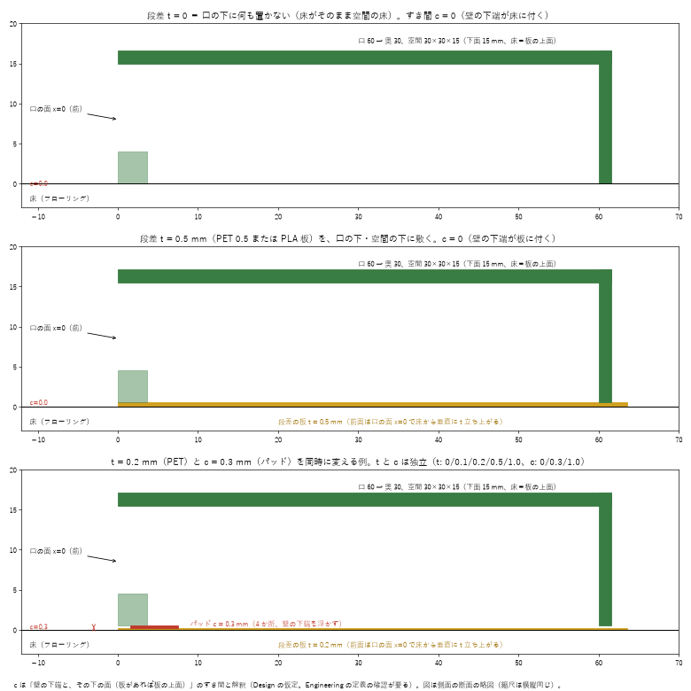

# 試験片 B2 — 漏斗つき開放底フード（段差 t とすき間 c を独立に変える）

> **【常に先頭に置く注意】KNUCKLE DRUM を入れても、まっすぐ（124 mm³）に比べ、曲げた姿勢では 2250〜2939 mm³ のすき間の体積が残る（約 20 倍、18〜24 倍）。背板の層（z ≥ 77）約 1020 mm³/姿勢は未解決、J1 ピッチは範囲の確認待ち。** 数値は CAD_CONCEPT / KINEMATIC_SIM。**安全・合格の語は使わない**。5.7 N・0.25 N·m は暫定（SAFETY_UNVERIFIED）。

**B1（`../README.md`、`../print/`）は上書きしていない。B1 のリップ（下面が床から浮く高さ 0 / 0.3 / 1.0）は、下の c に近く、Engineering の t を表せなかったので、B2 を別に作った。**

数値の由来: **[E]** = Engineering のシミュ（`simulation/scoop/forms`、`config/scoop.yaml`）のパラメータ、**[B]** = User の依頼、**[A]** = ASSUMED、**[C]** = 計算。由来は Fusion のコンポーネント名・ボディ名にも書いた（`TEST PIECE B2 …`、FW02 intake 複製の中）。

## 0. 「段差 0」の意味（先に読む）

- **段差 t = 口の下（と空間の下）に敷く「床の板」の厚み。板の前面が、口の面（x = 0）で床から t だけ垂直に立ち上がる。** 振る値 [E]: **0 / 0.1 / 0.2 / 0.5 / 1.0 mm**。
- **t = 0 は「口の下に何も置かない」こと。床がそのまま空間の床になる。**（板が薄いほどではなく、無いのが 0。Engineering のシミュでは t = 0.1 mm で全対象物の保持が 0 % に戻る。）
- **すき間 c = 壁の下端が、その下の面から浮く高さ。** 振る値 [E]: **0 / 0.3 / 1.0 mm**（シミュの既定 0.1）。
- **t と c は独立。** t は薄板（PET 0.1 / 0.2、PLA 0.5 / 1.0、マスキングテープ 1 枚 ≈ 0.1）で、c は差し替えパッドで切り替える。
- **Design の仮定（要確認）**: c は「壁の下端と、板があれば板の上面、無ければ床」のすき間とした。シミュが c を床から測るなら、t > c のとき壁の下端が板の中に入る組み合わせが出る。**Engineering に確認する**（ENTRY-D-0006）。

## 1. 部品（`print/`）

| ファイル | 材料 | 数 | 中身 |
|---|---|---|---|
| `B2_HOOD_PLA.stl` | PLA | 1 | フード本体。口 60 → 奥 30（深さ 30）[B]、空間 30×30×15 [B]、壁 1.6 [A]（シミュは 1.0、印刷の最小 1.2 以上にした）、足の帯 3.6×4 [A]、**壁の下端の面取り 0.3 [A]（象の足の対策）**、スカートの溝 1.2×2.5 [A]、垂れ布の座 8×54×3 と M2 の下穴 d1.6 [A]、ロッド穴 d8.4 深さ 20 [A]。**壁の下端を下（第 1 層）にした向きで出力済み** |
| `B2_STEP_SHEET_t0p5_PLA.stl` / `t1p0` | PLA | 各 1 | 段差の板 t = 0.5 / 1.0。外形は足の帯の形（63.6 × 68）。**前縁が口の面 x = 0** |
| `B2_STEP_SHEET_template_1to1.svg` | — | — | **PET 0.1 / 0.2 mm、マスキングテープ（0.1 mm）の切り出し用の外形（等倍）**。前縁（左）が口の面 |
| `B2_PADS_c0p3_x4_PLA.stl` / `c1p0` | PLA | 各 4 個 | すき間 c = 0.3 / 1.0 のパッド（3.4×8）。**c = 0 はパッドなし** |
| （B1 のスカート TPU、`../print/B1_SKIRT_H3_TPU.stl` ほか） | TPU 95A | 任意 | 溝は B2 のフードと同じ。**付けるとフードが H だけ上がる（c に H が足される）ので、t・c の試験とは別に使う** |
| （B1 のクランプ棒、`../print/B1_CLAMP_BAR_PLA.stl`） | PLA | 1 | 垂れ布（TPU 0.4〜0.6）をフードの座に M2 ×2 で留める |

## 2. 組み立て（t・c の切り替え）

1. **段差の板**（t）を作る: t = 0.1 / 0.2 は PET シートを外形のテンプレートで切る（マスキングテープは 1 枚 ≈ 0.1 で、重ねて 0.2）。0.5 / 1.0 は PLA の板。t = 0 は何も敷かない。
2. 板を、試験の床の上に**両面テープで貼る**（フードは板の上に載せて動かす）。前縁（口の面に合わせる線）を、床のマスク（マスキングテープの線）で決める。
3. **パッド**（c）を、フードの足の帯の下面 4 か所（前 2、奥 2。位置は STL の配置のとおり）に両面テープで貼る。c = 0 はパッドなし（壁の下端が板に付く）。
4. フードを載せる。ロッド穴に φ8 の棒を差して手で押す。

## 3. 印刷（Bambu A1）

- **PLA、0.4 ノズル、層 0.2、壁 4 周（1.6 mm）、インフィル 15 %。向きは STL のまま（壁の下端が第 1 層側）。支え: 屋根（幅 60 → 30 の橋渡し）は橋渡しで可（だめなら、屋根の下だけの支え）**。
- **象の足（第 1 層のはみ出し 0.1〜0.2 mm）の対策**:
  1. スライサの「象の足補正（Elephant foot compensation）」を **0.15〜0.2 mm**。
  2. モデルの壁の下端に **0.3 mm の面取り**を入れてある（外側・内側）。
  3. **印刷後、底面をやすり掛け**: ガラス板の上に耐水ペーパー #400 → #800 を貼り、フードを軽く押しながら 8 の字に動かし、**足の帯の下面が全周で均一につやが出るまで**（片当たりが無くなるまで）。
  4. 確認: 平らな板の上に載せ、下から光を当てて**光が漏れない**こと。0.1 mm のシックネスゲージ（または PET 0.1 の切れ端）が壁の下に**入らない**こと（c = 0 の場合）。
  5. 板・パッドも同じ向きで、同様に底面を軽く整える（パッドは厚みが c なので、やすり掛けは表面のバリ取りだけ）。
- **TPU（スカート）**: A1 では外付けスプール、AMS を通さない、低速。

## 4. User が見る観察項目

物: 1 円玉（φ20×1.5 [R]）、CR2032（φ20×3.2 [R]）、ビーズ（φ8）、立方体（10 mm）。床: 硬い床（フローリング）とマット。**絨毯は未対応**（毛にすき間が埋まる。Engineering の前提のまま）。

各条件（t × c の 15 通り）× 物 で、頭（フード）を手で押して次のどれかを記録する（`B2_test_log_template.csv`）:

| 記録 | 意味 |
|---|---|
| **入る** | 物が空間の中（奥の壁の前）に入った |
| **戻る** | いったん入ったが、押す向きを止める・戻すと口から出た |
| **下をくぐる** | 物が壁の下端の下をくぐった（c が大きいとき） |
| 押されて逃げた | 物が口の前で押されて、入らなかった（t が大きいとき） |
| 挟まった | 物や指が壁と床・板のあいだで動かなくなった |

**Engineering のシミュとの比較**: t = 0 で入り、t = 0.1 でも入らなくなるか（シミュは 0 %）。c が 0.3 / 1.0 のとき、1 円玉（厚み 1.5）と CR2032（3.2）が下をくぐるか（c 1.0 でも 1.5 のほうが厚い）。

## 5. 限界

- **形の確認は STL の断面まで。実物の嵌合・摩擦・パッドの貼り付き・PET の平らさは未確認。**
- シミュの壁は 1.0 mm、B2 は 1.6 mm（壁の外側が広い → 漏斗の前縁が少し鈍い）。空間の内寸は 30 のまま。
- ゲート（口の面に立つ板）は含めていない（受け身の垂れ布の座のみ）。
- 絨毯・毛は未対応。安全（指・しっぽの挟み込み）は未確認。**安全・合格とは言えない。**
